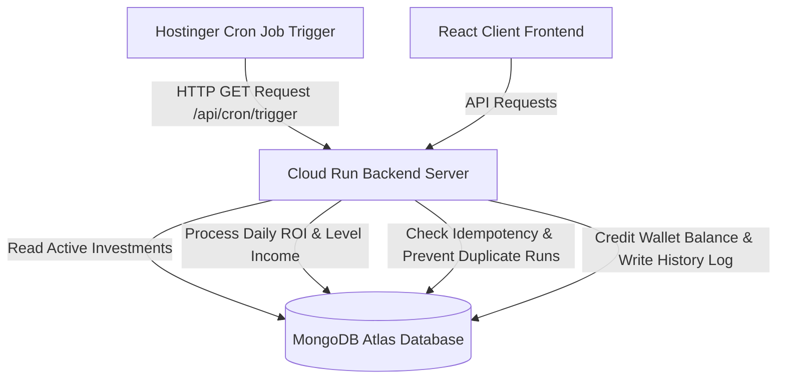

# NC Investment System

A modern, secure, and professional MERN Stack investment and multi-level referral platform. This application features automated daily ROI distributions, a dynamic multi-level referral structure with level commissions, interactive client dashboards, and cloud deployment with CI/CD.

---

## Live Production Links

*   **Frontend Dashboard:** [https://nci.goutam.fun](https://nci.goutam.fun)
*   **Backend Server URL:** `https://nc-investment-backend-913979470026.asia-south1.run.app`
*   **Cron Job Trigger URL:** `https://nc-investment-backend-913979470026.asia-south1.run.app/api/cron/trigger?secret=nc-inv-cron-2026`

---

## Technology Stack

*   **Frontend:** React (Vite), TailwindCSS, React Router DOM, Axios, Cookies, React Icons.
*   **Backend:** Node.js, Express.js, Mongoose/MongoDB, JSONWebToken (JWT), BcryptJS, Zod (Validations).
*   **Deployment & CI/CD:** Google Cloud Run (backend with Cloud Build + Artifact Registry), Hostinger shared hosting (frontend) & Hostinger cron job scheduler (automated triggers).

---

## Project Structure

```
nc-investment/
├── client/                 # React/Vite Frontend
│   ├── public/             # Static public assets (nc_logo.png)
│   ├── src/
│   │   ├── components/
│   │   │   ├── layouts/    # AdminLayout & UserLayout
│   │   │   ├── pages/      # Login, Register, Dashboards, ROI history
│   │   │   └── ui/         # Buttons, Cards, Inputs UI elements
│   │   ├── context/        # Authentication State Context
│   │   └── utils/          # Axios API config with JWT auto-headers
│   ├── .env.production     # Production API endpoint config
│   └── vite.config.js
│
├── server/                 # Node.js/Express Backend
│   ├── config/             # Database connection setups
│   ├── controllers/        # Auth, Plans, Investments, Referrals, Dashboard controllers
│   ├── middleware/         # JWT Auth, Role checking, Zod validator
│   ├── models/             # Mongoose Schemas (User, Investment, RoiHistory, ReferralIncome)
│   ├── routes/             # REST API route handlers
│   ├── services/           # ROI calculations & Referral tree business logic
│   └── utils/              # Seeder scripts and IST date calculation helpers
│
├── cloudbuild.yaml         # GCP CI/CD deployment configuration
└── README.md
```

---

## Data Flow Diagram (DFD)

The following diagram illustrates the simple top-down operational flow:



---

## Environment Variables Configuration

### Backend (`server/.env`)
Create a `.env` file inside the `server/` directory:
```env
PORT=5000
MONGODB_URI=mongodb+srv://db_user:<password>@cluster0.a7ejmcm.mongodb.net/nc_investment
TZ=Asia/Kolkata
CRON_SECRET=nc-inv-cron-2026
JWT_SECRET=jwt_super_secret_key_here
```

### Frontend (`client/.env.production`)
Create a `.env.production` file inside the `client/` directory:
```env
VITE_API_URL=https://nc-investment-backend-913979470026.asia-south1.run.app/api
```

---

## Local Installation & Setup

### Prerequisite
Ensure you have **Node.js (v18+)** and **MongoDB** installed and running locally.

### 1. Backend Setup
1. Navigate to the server folder:
   ```bash
   cd server
   ```
2. Install dependencies:
   ```bash
   npm install
   ```
3. Run the development server (runs on `http://localhost:5000`):
   ```bash
   npm run dev
   ```
   *Note: Live test accounts available for evaluation (seeded locally & live on production):*
   *   **Admin Account:**
       *   **Email:** `admin@admin.com`
       *   **Password:** `123456`
   *   **User Account:**
       *   **Email:** `user@gmail.com`
       *   **Password:** `123456`

### 2. Frontend Setup
1. Navigate to the client folder:
   ```bash
   cd ../client
   ```
2. Install dependencies:
   ```bash
   npm install
   ```
3. Run the Vite development server (runs on `http://localhost:5173`):
   ```bash
   npm run dev
   ```

---

## API Documentation & Endpoints

All requests should be sent with `Content-Type: application/json`. Protected endpoints require a `Authorization: Bearer <token>` header.

### 1. Authentication APIs
*   `POST /api/auth/register` (Public) - Registers a new user. Expects `fullName`, `email`, `mobileNumber`, `password`, and optional `referredBy` code.
*   `POST /api/auth/login` (Public) - Authenticates credentials and returns a JWT token.
*   `GET /api/auth/me` (Protected) - Fetches the active logged-in user profile.
*   `GET /api/auth/users` (Admin Only) - Lists all registered users.

### 2. Investment Plan APIs
*   `GET /api/plans` (Protected) - Retrieves all active investment plans.
*   `POST /api/plans` (Admin Only) - Creates a new investment plan (`name`, `minAmount`, `maxAmount`, `dailyRoiPercentage`, `validityDays`).
*   `DELETE /api/plans/:id` (Admin Only) - Removes/deactivates an investment plan.

### 3. Investment Contract APIs
*   `POST /api/investments` (Protected) - Purchase a plan (`planId`, `amount`). Validates plan ranges and updates active state.
*   `GET /api/investments` (Protected) - Lists active/completed investments for the user.

### 4. Referral & Level Income APIs
*   `GET /api/referrals/direct` (Protected) - Fetches all direct referrals (Level 1 downline list) for the authenticated user.
*   `GET /api/referrals/tree` (Protected) - Fetches a nested structure of direct and indirect downlines (based on plan configuration).
*   `GET /api/referrals` (Protected) - Returns logs of level commission payouts received.

### 5. Dashboard APIs
*   `GET /api/dashboard` (Protected) - Returns User statistics (Total Investment, Wallet Balance, ROI Earned, Level Income).
*   `GET /api/dashboard/admin` (Admin Only) - Returns System stats (Total users, Total investments, total ROI paid out, SVG performance chart data).

### 6. Automated Cron Scheduler
*   `GET /api/cron/trigger?secret=nc-inv-cron-2026` (Public via Secret Key) - Triggers midnight daily calculations. Wakes the serverless instance, runs ROI distributions, handles multi-level commissions, and writes immutable logs.

---

## Key Architectural Assumptions & Business Logic

### 1. Dynamic Plan Collection (Admin Managed)
The platform features a fully dynamic investment engine managed by administrators via the `Plan` collection. Each plan defines:
*   **Plan Name:** Unique name identifier for the contract.
*   **Daily ROI (Return on Investment):** The daily percentage payout credited to investors.
*   **Period:** Plan validity in days (after which the investment matures and expires).
*   **Minimum Investment Amount:** The minimum capital required to buy the plan.
*   **Dynamic Level Bonus Array:** An array of percentages representing the commission paid to referrers up the chain (e.g., `[5, 3, 2]` represents 3 referral levels where Level 1 receives 5%, Level 2 receives 3%, and Level 3 receives 2%). The number of downline referral levels is determined dynamically by the length of this array.
*   This schema is linked to the `Investment` collection via a `planDetails` ObjectId reference.

### 2. User Roles & Account Status
*   The `User` schema contains a `role` field restricted to `['admin', 'user']` (default is `'user'`). Role verification middleware (`authorize('admin')`) protects all sensitive routes (e.g. system dashboards, plan manager, user listings).
*   Accounts can also have an `accountStatus` (`'Active'`, `'Suspended'`). Referrers whose accounts are marked as `'Suspended'` are automatically skipped during the multi-level commission payouts.

### 3. Timezone Alignment
The platform operates strictly on **India Standard Time (Asia/Kolkata)**. All start and end boundaries for daily calculations are converted to IST bounds on the server to ensure that payouts and logs sync cleanly to local midnight (12:00 AM IST) regardless of where the cloud servers are physically located.

### 4. Daily ROI Cron Algorithm
The daily distribution process follows a strict transaction sequence to calculate and credit daily ROI:
*   **Step 1 (Fetch Active Contracts):** Query the `Investment` collection to retrieve all contracts where `status` is `'Active'`.
*   **Step 2 (Set IST Time Boundaries):** Compute the start boundary (`00:00:00.000`) and end boundary (`23:59:59.999`) for the current calendar date in the Kolkata timezone (IST).
*   **Step 3 (Verify Idempotency):** For each active contract, query the `RoiHistory` collection to check if an entry exists for that `investmentId` within the calculated IST start and end date boundaries. If a record is found, the system skips the contract to block duplicate processing.
*   **Step 4 (Fetch Profile & Calculate ROI):** Retrieve the user profile linked to the contract. Calculate the payout amount: `investmentAmount * (dailyRoiPercentage / 100)`.
*   **Step 5 (Log Transaction):** Create and save a new `RoiHistory` record with `status` set to `'Credited'` and `date` set to the current time in IST.
*   **Step 6 (Credit Wallet Balance):** Increment the user's `walletBalance` and `totalRoiEarned` by the calculated ROI payout. Save the updated user document to the database.
*   **Step 7 (Report Results):** Accumulate the execution logs to return a structured report showing total processed, successful, skipped, and failed payouts.

### 5. Decoupled Cron & Scalable Architecture
A dedicated external cron scheduler (Hostinger Cron) invokes the public GET `/api/cron/trigger?secret=nc-inv-cron-2026` endpoint. The request wakes up the serverless backend, executes the payout logic exactly once, and lets the container spin down. This eliminates duplicate payouts caused by server scaling (multiple instances) or serverless freezing.

### 6. Idempotent Daily ROI Distribution & Duplicate Prevention
To prevent double-crediting if the cron trigger is executed multiple times accidentally or called manually:
1.  **Date-Range Verification:** Upon execution, the server calculates the start and end timestamps of the current day in the Kolkata timezone.
2.  **History Check:** For each active investment contract, the server queries the `RoiHistory` collection to check if a log already exists for that `investmentId` within the calculated daily bounds.
3.  **Bypass:** If a log exists, the payout is skipped for that contract.
4.  **Transaction Safety:** Only contracts with no daily logs are processed, updating the user's `walletBalance` and `totalRoiEarned` before inserting a new `RoiHistory` record. This guarantees that each contract receives exactly one daily ROI payment per calendar day.
